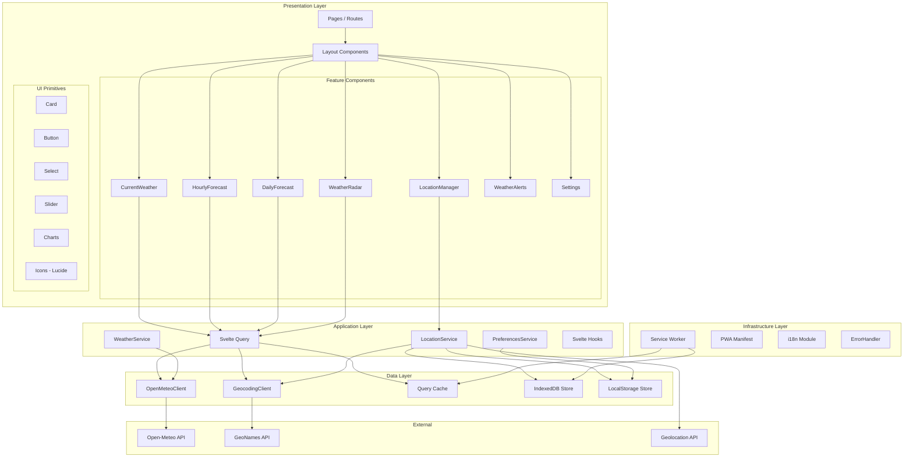
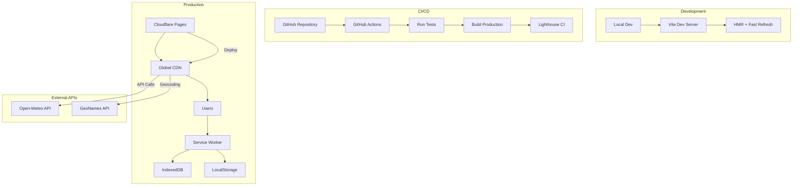

# Südtirol Wetter App V2 - System Architecture

## 1. Executive Summary

This document defines the system architecture for the Südtirol Wetter App V2, a complete rebuild of the weather application targeting South Tyrol (Südtirol), Italy. The architecture prioritizes performance, offline capability, and maintainability using modern web technologies.

**Architecture Type:** Client-side Single Page Application (SPA) with PWA capabilities  
**Deployment:** Static hosting (Cloudflare Pages / Vercel)  
**Data Strategy:** Client-side caching with service worker offline support  

---

## 2. Architecture Overview

### 2.1 High-Level Architecture

```
┌─────────────────────────────────────────────────────────────────┐
│                        PRESENTATION LAYER                       │
│  ┌─────────────┐ ┌─────────────┐ ┌─────────────┐ ┌──────────┐ │
│  │   Pages     │ │ Components  │ │   Layouts   │ │  Themes  │ │
│  │  (Routes)   │ │  (UI/UX)    │ │ (Structure) │ │  (CSS)   │ │
│  └─────────────┘ └─────────────┘ └─────────────┘ └──────────┘ │
└─────────────────────────────────────────────────────────────────┘
                              │
                              ▼
┌─────────────────────────────────────────────────────────────────┐
│                       APPLICATION LAYER                          │
│  ┌─────────────┐ ┌─────────────┐ ┌─────────────┐ ┌──────────┐ │
│  │   State     │ │  Business   │ │  Services   │ │  Hooks   │ │
│  │  (Runes)    │ │   Logic     │ │  (Coord)    │ │(Utilities)│
│  └─────────────┘ └─────────────┘ └─────────────┘ └──────────┘ │
└─────────────────────────────────────────────────────────────────┘
                              │
                              ▼
┌─────────────────────────────────────────────────────────────────┐
│                          DATA LAYER                              │
│  ┌─────────────┐ ┌─────────────┐ ┌─────────────┐ ┌──────────┐ │
│  │ API Clients │ │   Cache     │ │  Storage    │ │Transforms│ │
│  │ (Fetch)     │ │ (TanStack)  │ │ (IDB/LS)    │ │ (Data)   │ │
│  └─────────────┘ └─────────────┘ └─────────────┘ └──────────┘ │
└─────────────────────────────────────────────────────────────────┘
                              │
                              ▼
┌─────────────────────────────────────────────────────────────────┐
│                      INFRASTRUCTURE LAYER                        │
│  ┌─────────────┐ ┌─────────────┐ ┌─────────────┐ ┌──────────┐ │
│  │  Service    │ │   PWA       │ │   Build     │ │  i18n    │ │
│  │  Worker     │ │  Manifest   │ │   Config    │ │ (Lang)   │ │
│  └─────────────┘ └─────────────┘ └─────────────┘ └──────────┘ │
└─────────────────────────────────────────────────────────────────┘
                              │
                              ▼
┌─────────────────────────────────────────────────────────────────┐
│                      EXTERNAL SERVICES                           │
│  ┌─────────────┐ ┌─────────────┐ ┌─────────────┐              │
│  │ Open-Meteo  │ │  GeoNames   │ │   Geolocation│              │
│  │   (API)     │ │   (API)     │ │   (Browser) │              │
│  └─────────────┘ └─────────────┘ └─────────────┘              │
└─────────────────────────────────────────────────────────────────┘
```

### 2.2 Technology Stack

| Layer | Technology | Purpose |
|-------|------------|---------|
| **Framework** | SvelteKit 2.x + Svelte 5 | UI framework with runes reactivity |
| **Styling** | Tailwind CSS v4 | Utility-first CSS |
| **Components** | shadcn-svelte + Lucide | Accessible UI primitives + icons |
| **State** | TanStack Query (Svelte) | Server state + caching |
| **Local State** | Svelte 5 Runes ($state) | Component state |
| **Persistence** | IndexedDB + localStorage | Offline data storage |
| **Build** | Vite 6.x | Development + bundling |
| **Testing** | Vitest + Playwright | Unit + E2E tests |
| **Type Safety** | TypeScript 5.x (strict) | Compile-time checks |

---

## 3. Component Architecture

### 3.1 Mermaid Component Diagram



### 3.2 Directory Structure

```
src/
├── lib/
│   ├── components/
│   │   ├── ui/                    # shadcn-svelte primitives
│   │   │   ├── button/
│   │   │   ├── card/
│   │   │   ├── select/
│   │   │   └── ...
│   │   ├── weather/               # Weather-specific components
│   │   │   ├── CurrentWeather.svelte
│   │   │   ├── HourlyForecast.svelte
│   │   │   ├── DailyForecast.svelte
│   │   │   ├── WeatherIcon.svelte
│   │   │   ├── TemperatureChart.svelte
│   │   │   └── WindDisplay.svelte
│   │   ├── location/
│   │   │   ├── LocationSearch.svelte
│   │   │   ├── LocationSelector.svelte
│   │   │   └── FavoritesList.svelte
│   │   ├── radar/
│   │   │   └── PrecipitationRadar.svelte
│   │   ├── alerts/
│   │   │   └── WeatherAlerts.svelte
│   │   └── layout/
│   │       ├── Header.svelte
│   │       ├── Footer.svelte
│   │       └── Navigation.svelte
│   │
│   ├── services/
│   │   ├── weather.service.ts      # Weather data orchestration
│   │   ├── location.service.ts     # Location management
│   │   ├── preferences.service.ts # User preferences
│   │   └── offline.service.ts      # Offline detection
│   │
│   ├── api/
│   │   ├── open-meteo.client.ts    # Open-Meteo API client
│   │   ├── geocoding.client.ts     # Geocoding API client
│   │   └── http.client.ts         # Base HTTP client
│   │
│   ├── stores/
│   │   ├── locations.store.ts      # Svelte stores for locations
│   │   ├── preferences.store.ts    # User preferences store
│   │   └── offline.store.ts        # Offline state store
│   │
│   ├── queries/
│   │   ├── weather.queries.ts      # TanStack Query definitions
│   │   └── location.queries.ts     # Location query definitions
│   │
│   ├── utils/
│   │   ├── date.utils.ts          # Date/timezone handling
│   │   ├── weather.utils.ts        # Weather data transforms
│   │   ├── i18n.utils.ts           # Internationalization helpers
│   │   └── cache.utils.ts          # Caching utilities
│   │
│   ├── types/
│   │   ├── weather.types.ts        # Weather data types
│   │   ├── location.types.ts       # Location types
│   │   ├── api.types.ts            # API response types
│   │   └── preferences.types.ts    # User preference types
│   │
│   ├── hooks/
│   │   ├── use-geolocation.svelte.ts
│   │   ├── use-offline.svelte.ts
│   │   └── use-preferences.svelte.ts
│   │
│   └── i18n/
│       ├── index.ts                # i18n configuration
│       └── locales/
│           ├── de.json             # German (primary)
│           ├── it.json             # Italian
│           ├── en.json             # English
│           └── ld.json             # Ladin
│
├── routes/
│   ├── +layout.svelte              # Root layout
│   ├── +page.svelte                # Home (current weather)
│   ├── forecast/
│   │   └── +page.svelte            # Detailed forecast
│   ├── radar/
│   │   └── +page.svelte            # Precipitation radar
│   ├── mountain/
│   │   └── +page.svelte            # Mountain weather
│   ├── settings/
│   │   └── +page.svelte            # User settings
│   └── +error.svelte               # Error boundary
│
├── static/
│   ├── manifest.json               # PWA manifest
│   ├── icons/                      # App icons
│   └── fonts/                      # Custom fonts (if any)
│
├── service-worker.ts               # Service worker for offline
└── app.html                        # HTML template
```

---

## 4. Data Models & Schemas

### 4.1 Core Data Models

#### Weather Data Models

```typescript
// src/lib/types/weather.types.ts

/** Current weather conditions */
interface CurrentWeather {
  location: LocationReference;
  timestamp: Date;
  timezone: string;
  
  temperature: TemperatureData;
  feelsLike: number;
  humidity: HumidityData;
  wind: WindData;
  pressure: PressureData;
  visibility: VisibilityData;
  uv: UVData;
  precipitation: PrecipitationData;
  condition: WeatherCondition;
  sun: SunData;
}

interface TemperatureData {
  current: number;           // Current temperature (°C)
  min: number;               // Daily low
  max: number;               // Daily high
  unit: 'celsius' | 'fahrenheit';
}

interface HumidityData {
  relative: number;          // Percentage (0-100)
  dewpoint: number;          // °C
}

interface WindData {
  speed: number;             // km/h
  gusts: number;             // km/h
  direction: WindDirection; // degrees + cardinal
  beaufortScale: number;     // 0-12
}

interface WindDirection {
  degrees: number;           // 0-360
  cardinal: string;          // N, NE, E, etc.
}

interface PressureData {
  value: number;             // hPa
  trend: 'rising' | 'falling' | 'steady';
}

interface VisibilityData {
  value: number;              // km
  category: 'excellent' | 'good' | 'moderate' | 'poor';
}

interface UVData {
  index: number;              // 0-11+
  category: UVCategory;
  recommendation: string;
}

type UVCategory = 'low' | 'moderate' | 'high' | 'very-high' | 'extreme';

interface PrecipitationData {
  probability: number;        // 0-100%
  amount: number;            // mm
  type: 'none' | 'rain' | 'sleet' | 'snow' | 'hail';
}

interface WeatherCondition {
  code: WeatherCode;         // WMO weather code
  description: LocalizedString;
  icon: string;               // Icon identifier
  isNight: boolean;
}

// WMO Weather Codes (0-99)
type WeatherCode = 
  | 0   // Clear sky
  | 1   // Mainly clear
  | 2   // Partly cloudy
  | 3   // Overcast
  | 45  // Fog
  | 48  // Depositing rime fog
  | 51  // Drizzle: Light
  | 53  // Drizzle: Moderate
  | 55  // Drizzle: Dense
  | 56  // Freezing Drizzle: Light
  | 57  // Freezing Drizzle: Dense
  | 61  // Rain: Slight
  | 63  // Rain: Moderate
  | 65  // Rain: Heavy
  | 66  // Freezing Rain: Light
  | 67  // Freezing Rain: Heavy
  | 71  // Snow fall: Slight
  | 73  // Snow fall: Moderate
  | 75  // Snow fall: Heavy
  | 77  // Snow grains
  | 80  // Rain showers: Slight
  | 81  // Rain showers: Moderate
  | 82  // Rain showers: Violent
  | 85  // Snow showers: Slight
  | 86  // Snow showers: Moderate
  | 95  // Thunderstorm
  | 96  // Thunderstorm with slight hail
  | 99; // Thunderstorm with heavy hail

interface SunData {
  sunrise: Date;
  sunset: Date;
  solarNoon: Date;
  daylight: Duration;        // Daylight duration
}

/** Hourly forecast data */
interface HourlyForecast {
  location: LocationReference;
  hours: HourlyData[];
  generatedAt: Date;
  expiresAt: Date;
}

interface HourlyData {
  timestamp: Date;
  temperature: number;
  feelsLike: number;
  humidity: number;
  windSpeed: number;
  windDirection: number;
  windGusts: number;
  precipitationProbability: number;
  precipitationAmount: number;
  weatherCode: WeatherCode;
  visibility: number;
  isDay: boolean;
}

/** 7-day daily forecast */
interface DailyForecast {
  location: LocationReference;
  days: DailyData[];
  generatedAt: Date;
  expiresAt: Date;
}

interface DailyData {
  date: Date;
  tempMax: number;
  tempMin: number;
  feelsLikeMax: number;
  feelsLikeMin: number;
  precipitationProbability: number;
  precipitationSum: number;
  weatherCode: WeatherCode;
  sunrise: Date;
  sunset: Date;
  uvIndexMax: number;
  windSpeedMax: number;
  windGustsMax: number;
  windDirection: number;
}
```

#### Location Data Models

```typescript
// src/lib/types/location.types.ts

/** South Tyrol location with i18n support */
interface Location {
  id: string;                 // Slug-based ID
  name: LocalizedString;      // Names in 4 languages
  coordinates: Coordinates;
  elevation: number;          // meters
  region: SouthTyrolRegion;
  timezone: string;
  population?: number;        // For sorting
  isFavorite?: boolean;
  lastAccessed?: Date;
}

interface LocalizedString {
  de: string;                 // German
  it: string;                 // Italian
  en: string;                 // English
  ld?: string;                // Ladin (may be missing)
}

interface Coordinates {
  latitude: number;
  longitude: number;
}

/** South Tyrol regions */
type SouthTyrolRegion = 
  | 'bolzano'
  | 'meran'
  | 'bozen-uberetsch'
  | 'vinschgau'
  | 'eisacktal'
  | 'pustertal'
  | 'salten-schlern'
  | 'ubbental';

/** User location preference */
interface UserLocation extends Location {
  isCurrent: boolean;        // Geolocation detected
  isFavorite: boolean;
  order: number;             // Display order
}

/** Geolocation result */
interface GeolocationResult {
  success: boolean;
  coordinates?: Coordinates;
  error?: GeolocationError;
  location?: Location;       // Resolved location
}

type GeolocationError = 
  | 'PERMISSION_DENIED'
  | 'POSITION_UNAVAILABLE'
  | 'TIMEOUT'
  | 'NOT_SUPPORTED';
```

#### User Preferences Data Models

```typescript
// src/lib/types/preferences.types.ts

/** User preferences persisted in localStorage */
interface UserPreferences {
  language: SupportedLanguage;
  temperatureUnit: 'celsius' | 'fahrenheit';
  windSpeedUnit: 'kmh' | 'ms' | 'mph' | 'kn';
  pressureUnit: 'hPa' | 'mmHg' | 'inHg';
  timeFormat: '24h' | '12h';
  theme: ThemePreference;
  notifications: NotificationSettings;
  locations: LocationPreferences;
  lastUpdated: Date;
}

type SupportedLanguage = 'de' | 'it' | 'en' | 'ld';

type ThemePreference = 'light' | 'dark' | 'system' | 'oled';

interface NotificationSettings {
  severeWeather: boolean;
  severeWeatherLevel: AlertLevel;
  dailyForecast: boolean;
  dailyForecastTime?: string;    // HH:mm format
}

type AlertLevel = 'moderate' | 'severe' | 'extreme';

interface LocationPreferences {
  favorites: string[];            // Location IDs
  recent: string[];               // Recently viewed
  defaultLocation: string | 'current';
  useGeolocation: boolean;
}
```

### 4.2 API Response Schemas (Open-Meteo)

```typescript
// src/lib/types/api.types.ts

/** Open-Meteo Current Weather Response */
interface OpenMeteoCurrentResponse {
  latitude: number;
  longitude: number;
  generationtime_ms: number;
  utc_offset_seconds: number;
  timezone: string;
  current: {
    time: string;                // ISO datetime
    interval: number;
    temperature_2m: number;
    relative_humidity_2m: number;
    apparent_temperature: number;
    is_day: number;              // 0 or 1
    precipitation: number;
    rain: number;
    showers: number;
    snowfall: number;
    weather_code: number;
    cloud_cover: number;
    pressure_msl: number;
    surface_pressure: number;
    wind_speed_10m: number;
    wind_direction_10m: number;
    wind_gusts_10m: number;
  };
  daily?: OpenMeteoDailyData;
}

/** Open-Meteo Hourly Forecast Response */
interface OpenMeteoHourlyResponse {
  latitude: number;
  longitude: number;
  hourly: {
    time: string[];
    temperature_2m: number[];
    relative_humidity_2m: number[];
    apparent_temperature: number[];
    precipitation_probability: number[];
    precipitation: number[];
    weather_code: number[];
    wind_speed_10m: number[];
    wind_direction_10m: number[];
    wind_gusts_10m: number[];
    visibility: number[];
    is_day: number[];
  };
}

/** Open-Meteo Daily Forecast Response */
interface OpenMeteoDailyResponse {
  latitude: number;
  longitude: number;
  daily: {
    time: string[];
    weather_code: number[];
    temperature_2m_max: number[];
    temperature_2m_min: number[];
    apparent_temperature_max: number[];
    apparent_temperature_min: number[];
    sunrise: string[];
    sunset: string[];
    uv_index_max: number[];
    precipitation_sum: number[];
    precipitation_probability_max: number[];
    wind_speed_10m_max: number[];
    wind_gusts_10m_max: number[];
    wind_direction_10m_dominant: number[];
  };
}
```

### 4.3 Storage Schema (IndexedDB)

```typescript
// IndexedDB schema for offline storage

const DB_NAME = 'suedtirol-wetter';
const DB_VERSION = 1;

/**
 * Object Stores:
 * 
 * 1. locations     - Persisted location data
 * 2. weather-cache - Cached weather responses
 * 3. preferences   - User preferences backup
 */

interface DBSchema {
  locations: {
    key: string;              // Location ID
    value: Location;
    indexes: {
      'by-name': string;      // German name
      'by-region': SouthTyrolRegion;
    };
  };
  
  'weather-cache': {
    key: string;              // cacheKey: `${locationId}_${type}`
    value: CacheEntry;
    indexes: {
      'by-location': string;
      'by-expires': Date;
    };
  };
  
  preferences: {
    key: 'main';
    value: UserPreferences;
  };
}

interface CacheEntry {
  key: string;
  locationId: string;
  type: 'current' | 'hourly' | 'daily';
  data: unknown;
  fetchedAt: Date;
  expiresAt: Date;
}
```

---

## 5. API Specifications

### 5.1 Open-Meteo API Client

```typescript
// src/lib/api/open-meteo.client.ts

interface OpenMeteoClientOptions {
  baseUrl?: string;
  timeout?: number;
  userAgent?: string;
}

const DEFAULT_OPTIONS: OpenMeteoClientOptions = {
  baseUrl: 'https://api.open-meteo.com/v1',
  timeout: 10000,
  userAgent: 'SuedtirolWetter/2.0'
};

class OpenMeteoClient {
  private options: OpenMeteoClientOptions;
  
  constructor(options?: Partial<OpenMeteoClientOptions>) {
    this.options = { ...DEFAULT_OPTIONS, ...options };
  }
  
  /** Get current weather for coordinates */
  async getCurrentWeather(
    coords: Coordinates,
    options?: CurrentWeatherOptions
  ): Promise<OpenMeteoCurrentResponse>;
  
  /** Get hourly forecast for coordinates */
  async getHourlyForecast(
    coords: Coordinates,
    options?: HourlyForecastOptions
  ): Promise<OpenMeteoHourlyResponse>;
  
  /** Get daily forecast for coordinates */
  async getDailyForecast(
    coords: Coordinates,
    days: number = 7
  ): Promise<OpenMeteoDailyResponse>;
  
  /** Get combined weather data (current + hourly + daily) */
  async getWeatherBundle(
    coords: Coordinates,
    options?: WeatherBundleOptions
  ): Promise<WeatherBundle>;
  
  // Private methods
  private buildUrl(endpoint: string, params: Record<string, unknown>): URL;
  private async fetch<T>(url: URL): Promise<T>;
  private handleRateLimit(response: Response): Promise<void>;
  private transformError(error: unknown): WeatherApiError;
}
```

### 5.2 API Request/Response Patterns

#### Current Weather Request

```
GET https://api.open-meteo.com/v1/forecast
  ?latitude=46.4983
  &longitude=11.3548
  &current=temperature_2m,relative_humidity_2m,apparent_temperature,
           precipitation,weather_code,cloud_cover,pressure_msl,
           wind_speed_10m,wind_direction_10m,wind_gusts_10m
  &daily=temperature_2m_max,temperature_2m_min,sunrise,sunset
  &timezone=Europe/Rome
  &forecast_days=1
```

#### Hourly Forecast Request

```
GET https://api.open-meteo.com/v1/forecast
  ?latitude=46.4983
  &longitude=11.3548
  &hourly=temperature_2m,relative_humidity_2m,apparent_temperature,
          precipitation_probability,precipitation,weather_code,
          wind_speed_10m,wind_direction_10m,wind_gusts_10m,visibility
  &timezone=Europe/Rome
  &forecast_hours=48
```

### 5.3 Caching Strategy

```typescript
// src/lib/utils/cache.utils.ts

interface CacheStrategy {
  current: {
    staleTime: 5 * 60 * 1000;      // 5 minutes
    cacheTime: 30 * 60 * 1000;      // 30 minutes
    refetchOnWindowFocus: true;
  };
  hourly: {
    staleTime: 15 * 60 * 1000;      // 15 minutes
    cacheTime: 2 * 60 * 60 * 1000;  // 2 hours
    refetchOnWindowFocus: true;
  };
  daily: {
    staleTime: 30 * 60 * 1000;      // 30 minutes
    cacheTime: 4 * 60 * 60 * 1000;  // 4 hours
    refetchOnWindowFocus: false;
  };
  location: {
    staleTime: Infinity;            // Locations don't change often
    cacheTime: 24 * 60 * 60 * 1000;  // 24 hours
  };
}

// TanStack Query setup
const queryClient = new QueryClient({
  defaultOptions: {
    queries: {
      retry: 3,
      retryDelay: (attempt) => Math.min(1000 * 2 ** attempt, 30000),
      refetchOnWindowFocus: true,
      refetchOnReconnect: true,
    },
  },
});
```

---

## 6. Error Handling Strategy

### 6.1 Error Classification

```typescript
// src/lib/types/errors.types.ts

/** Base error class for weather app */
abstract class WeatherAppError extends Error {
  abstract readonly code: ErrorCode;
  abstract readonly severity: 'low' | 'medium' | 'high' | 'critical';
  abstract readonly recoverable: boolean;
  readonly timestamp: Date;
  readonly context?: Record<string, unknown>;
  
  constructor(message: string, context?: Record<string, unknown>) {
    super(message);
    this.timestamp = new Date();
    this.context = context;
  }
}

/** Error codes enumeration */
type ErrorCode =
  // Network errors
  | 'NETWORK_OFFLINE'
  | 'NETWORK_TIMEOUT'
  | 'NETWORK_ERROR'
  
  // API errors
  | 'API_RATE_LIMIT'
  | 'API_INVALID_RESPONSE'
  | 'API_UNAVAILABLE'
  | 'API_FORBIDDEN'
  
  // Location errors
  | 'LOCATION_PERMISSION_DENIED'
  | 'LOCATION_UNAVAILABLE'
  | 'LOCATION_NOT_FOUND'
  
  // Data errors
  | 'DATA_STALE'
  | 'DATA_INVALID'
  | 'DATA_PARSE_ERROR'
  
  // Storage errors
  | 'STORAGE_QUOTA_EXCEEDED'
  | 'STORAGE_UNAVAILABLE'
  
  // User errors
  | 'INVALID_INPUT';

/** Network offline error */
class NetworkOfflineError extends WeatherAppError {
  readonly code = 'NETWORK_OFFLINE';
  readonly severity = 'medium';
  readonly recoverable = true;
}

/** API rate limit error */
class ApiRateLimitError extends WeatherAppError {
  readonly code = 'API_RATE_LIMIT';
  readonly severity = 'high';
  readonly recoverable = true;
  readonly retryAfter?: number;
}

/** Location permission denied */
class LocationPermissionError extends WeatherAppError {
  readonly code = 'LOCATION_PERMISSION_DENIED';
  readonly severity = 'medium';
  readonly recoverable = false; // Requires user action
}
```

### 6.2 Error Handling Flow

```mermaid
flowchart TD
    A[User Action] --> B{Online?}
    
    B -->|No| C[NetworkOfflineError]
    C --> D[Show Cached Data]
    D --> E[Show Offline Banner]
    
    B -->|Yes| F[API Request]
    F --> G{Response OK?}
    
    G -->|Yes| H[Transform Data]
    H --> I[Update Cache]
    I --> J[Return Data]
    
    G -->|No| K{Error Type}
    
    K -->|Rate Limit| L[ApiRateLimitError]
    L --> M[Use Cached Data]
    M --> N[Scheduled Retry]
    
    K -->|Server Error| O
[ApiUnavailableError]
    O --> P[Try Fallback Cache]
    P --> Q{Cache Available?}
    Q -->|Yes| R[Return Stale Data + Warning]
    Q -->|No| S[Show Error State]
    
    K -->|Validation| T[DataParseError]
    T --> U[Log Error]
    U --> V[Try Fallback Cache]
    
    K -->|Other| W[Unknown Error]
    W --> X[Generic Error State]
```

### 6.3 Error Handler Implementation

```typescript
// src/lib/services/error-handler.service.ts

class ErrorHandler {
  private errorQueue: WeatherAppError[] = [];
  private subscribers: Set<ErrorSubscriber> = new Set();
  
  /**
   * Handle an error with appropriate recovery strategy
   */
  async handle(error: unknown): Promise<ErrorResult> {
    const appError = this.normalize(error);
    
    // Log error (dev mode)
    if (import.meta.env.DEV) {
      console.error('[ErrorHandler]', appError, appError.context);
    }
    
    // Track for analytics
    this.track(appError);
    
    // Determine recovery strategy
    const strategy = this.getStrategy(appError);
    
    // Execute recovery
    const result = await this.recover(appError, strategy);
    
    // Notify subscribers
    this.notify(appError, result);
    
    return result;
  }
  
  /**
   * Subscribe to error notifications
   */
  subscribe(callback: ErrorSubscriber): () => void {
    this.subscribers.add(callback);
    return () => this.subscribers.delete(callback);
  }
  
  // Private methods
  
  private normalize(error: unknown): WeatherAppError {
    // Convert various error types to WeatherAppError
    if (error instanceof WeatherAppError) return error;
    if (error instanceof TypeError) return new DataParseError(error.message);
    if (!navigator.onLine) return new NetworkOfflineError();
    // ... more normalizations
  }
  
  private getStrategy(error: WeatherAppError): RecoveryStrategy {
    switch (error.code) {
      case 'NETWORK_OFFLINE':
        return { action: 'cache-fallback', showBanner: true };
      case 'API_RATE_LIMIT':
        return { action: 'cache-fallback', retry: true, delay: 60000 };
      case 'API_UNAVAILABLE':
        return { action: 'cache-fallback-expires', maxAge: 7200000 };
      case 'LOCATION_PERMISSION_DENIED':
        return { action: 'prompt-settings', useDefault: true };
      default:
        return { action: 'show-error' };
    }
  }
  
  private async recover(
    error: WeatherAppError,
    strategy: RecoveryStrategy
  ): Promise<ErrorResult> {
    // Implementation depends on strategy
    // Returns appropriate fallback or error state
  }
}
```

### 6.4 User-Facing Error Messages

```typescript
// src/lib/i18n/error-messages.ts

const ERROR_MESSAGES: Record<ErrorCode, LocalizedString> = {
  NETWORK_OFFLINE: {
    de: 'Keine Internetverbindung. Zeige zuletzt geladene Daten.',
    it: 'Nessuna connessione internet. Visualizzazione ultimi dati.',
    en: 'No internet connection. Showing last loaded data.',
    ld: 'Nia connexiun internet. Musteren ülters daddos.',
  },
  
  API_RATE_LIMIT: {
    de: 'Wetterdienst vorübergehend nicht verfügbar. Bitte in kurzem erneut versuchen.',
    it: 'Servizio meteo temporaneamente non disponibile. Riprovare a breve.',
    en: 'Weather service temporarily unavailable. Please try again shortly.',
    ld: 'Servizi meteo temporairemang no däspunibel.',
  },
  
  LOCATION_PERMISSION_DENIED: {
    de: 'Standortberechtigung verweigert. Bitte Standort in den Einstellungen aktivieren.',
    it: 'Autorizzazione posizione negata. Attivare nelle impostazioni.',
    en: 'Location permission denied. Please enable in settings.',
    ld: 'Autorisaziun dla posiziun refudeda.',
  },
  
  // ... more error messages
};
```

---

## 7. State Management Architecture

### 7.1 State Categories

```
┌─────────────────────────────────────────────────────────────────┐
│                     STATE ARCHITECTURE                          │
├─────────────────────────────────────────────────────────────────┤
│                                                                 │
│  ┌─────────────────┐     Server State (TanStack Query)         │
│  │   Weather Data  │     - Current weather                     │
│  │   Locations     │     - Forecasts                           │
│  │   (Remote)      │     - Geocoding results                   │
│  └─────────────────┘     - Auto-refetch, caching, deduping    │
│                                                                 │
│  ┌─────────────────┐     Client State (Svelte Runes)           │
│  │   UI State      │     - Active tab/view                     │
│  │   Form Inputs   │     - Modal visibility                    │
│  │   (Transient)   │     - Search input                        │
│  └─────────────────┘     - Component-specific state            │
│                                                                 │
│  ┌─────────────────┐     Persisted State                       │
│  │   Preferences   │     - Language, units                     │
│  │   Favorites     │     - Favorite locations                  │
│  │   (LocalStorage)│     - Theme preference                    │
│  └─────────────────┘                                           │
│                                                                 │
│  ┌─────────────────┐     Offline State (IndexedDB)             │
│  │   Cached Data   │     - Last weather responses              │
│  │   Locations DB  │     - Location database                    │
│  │   (IDB)         │     - Offline backup of preferences       │
│  └─────────────────┘                                           │
│                                                                 │
└─────────────────────────────────────────────────────────────────┘
```

### 7.2 TanStack Query Configuration

```typescript
// src/lib/queries/weather.queries.ts

import { createQuery, createInfiniteQuery } from '@tanstack/svelte-query';

// Query keys for cache management
export const weatherKeys = {
  all: ['weather'] as const,
  current: (coords: Coordinates) => [...weatherKeys.all, 'current', coords] as const,
  hourly: (coords: Coordinates) => [...weatherKeys.all, 'hourly', coords] as const,
  daily: (coords: Coordinates) => [...weatherKeys.all, 'daily', coords] as const,
  bundle: (coords: Coordinates) => [...weatherKeys.all, 'bundle', coords] as const,
};

// Current weather query
export function useCurrentWeather(coords: Coordinates) {
  return createQuery(() => ({
    queryKey: weatherKeys.current(coords),
    queryFn: () => weatherClient.getCurrentWeather(coords),
    staleTime: 5 * 60 * 1000,
    gcTime: 30 * 60 * 1000,
    refetchOnWindowFocus: true,
    enabled: !!coords,
  }));
}

// Hourly forecast query
export function useHourlyForecast(coords: Coordinates) {
  return createQuery(() => ({
    queryKey: weatherKeys.hourly(coords),
    queryFn: () => weatherClient.getHourlyForecast(coords),
    staleTime: 15 * 60 * 1000,
    gcTime: 2 * 60 * 60 * 1000,
    refetchOnWindowFocus: true,
    enabled: !!coords,
  }));
}

// Daily forecast query
export function useDailyForecast(coords: Coordinates) {
  return createQuery(() => ({
    queryKey: weatherKeys.daily(coords),
    queryFn: () => weatherClient.getDailyForecast(coords),
    staleTime: 30 * 60 * 1000,
    gcTime: 4 * 60 * 60 * 1000,
    refetchOnWindowFocus: false,
    enabled: !!coords,
  }));
}

// Combined bundle query for initial load
export function useWeatherBundle(coords: Coordinates) {
  return createQuery(() => ({
    queryKey: weatherKeys.bundle(coords),
    queryFn: () => weatherClient.getWeatherBundle(coords),
    staleTime: 5 * 60 * 1000,
    gcTime: 30 * 60 * 1000,
    refetchOnWindowFocus: true,
    enabled: !!coords,
  }));
}
```

---

## 8. Offline & PWA Architecture

### 8.1 Service Worker Strategy

```typescript
// service-worker.ts

const CACHE_VERSION = 'v2';
const STATIC_CACHE = `static-${CACHE_VERSION}`;
const API_CACHE = `api-${CACHE_VERSION}`;

// Static assets to cache immediately
const STATIC_ASSETS = [
  '/',
  '/forecast',
  '/radar',
  '/settings',
  '/manifest.json',
  // JS/CSS will be added by build process
];

// API endpoints to cache
const API_PATTERNS = [
  /api\.open-meteo\.com\/v1\/forecast/,
  /api\.open-meteo\.com\/v1\/geocoding/,
];

// Install event - cache static assets
self.addEventListener('install', (event) => {
  event.waitUntil(
    caches.open(STATIC_CACHE).then((cache) => {
      return cache.addAll(STATIC_ASSETS);
    })
  );
});

// Fetch event - network-first for API, cache-first for static
self.addEventListener('fetch', (event) => {
  const url = new URL(event.request.url);
  
  // API requests - Network first, fall back to cache
  if (API_PATTERNS.some((pattern) => pattern.test(url.href))) {
    event.respondWith(networkFirst(event.request));
    return;
  }
  
  // Static assets - Cache first, fall back to network
  event.respondWith(cacheFirst(event.request));
});

// Network-first strategy for API
async function networkFirst(request: Request): Promise<Response> {
  try {
    const networkResponse = await fetch(request);
    
    // Cache successful responses
    if (networkResponse.ok) {
      const cache = await caches.open(API_CACHE);
      cache.put(request, networkResponse.clone());
    }
    
    return networkResponse;
  } catch (error) {
    // Network failed, try cache
    const cachedResponse = await caches.match(request);
    if (cachedResponse) {
      // Mark as stale so UI knows
      const headers = new Headers(cachedResponse.headers);
      headers.set('X-Stale', 'true');
      return new Response(cachedResponse.body, {
        status: cachedResponse.status,
        statusText: cachedResponse.statusText,
        headers,
      });
    }
    
    // No cache available
    return new Response(JSON.stringify({ error: 'offline' }), {
      status: 503,
      headers: { 'Content-Type': 'application/json' },
    });
  }
}

// Cache-first strategy for static assets
async function cacheFirst(request: Request): Promise<Response> {
  const cachedResponse = await caches.match(request);
  if (cachedResponse) return cachedResponse;
  
  const networkResponse = await fetch(request);
  
  if (networkResponse.ok) {
    const cache = await caches.open(STATIC_CACHE);
    cache.put(request, networkResponse.clone());
  }
  
  return networkResponse;
}
```

### 8.2 Offline Detection

```typescript
// src/lib/hooks/use-offline.svelte.ts

export function useOffline() {
  let isOffline = $state(false);
  let wasOffline = $state(false);
  
  $effect(() => {
    const handleOnline = () => {
      wasOffline = isOffline;
      isOffline = false;
    };
    
    const handleOffline = () => {
      isOffline = true;
      wasOffline = false;
    };
    
    window.addEventListener('online', handleOnline);
    window.addEventListener('offline', handleOffline);
    
    // Initial state
    isOffline = !navigator.onLine;
    
    return () => {
      window.removeEventListener('online', handleOnline);
      window.removeEventListener('offline', handleOffline);
    };
  });
  
  return {
    get isOffline() { return isOffline; },
    get wasOffline() { return wasOffline; },
  };
}
```

---

## 9. Internationalization (i18n) Architecture

### 9.1 i18n Strategy

```typescript
// src/lib/i18n/index.ts

import { derived } from 'svelte/store';
import { createI18n } from 'sveltekit-i18n';
import type { Config } from 'sveltekit-i18n';

// Locale definitions
const LOCALES = {
  de: { name: 'Deutsch', fallback: 'en' },
  it: { name: 'Italiano', fallback: 'en' },
  en: { name: 'English' },
  ld: { name: 'Ladin', fallback: 'de' },
} as const;

type Locale = keyof typeof LOCALES;

// Configuration
const config: Config = {
  loaders: [
    {
      locale: 'de',
      key: 'common',
      loader: () => import('./locales/de.json'),
    },
    {
      locale: 'it',
      key: 'common',
      loader: () => import('./locales/it.json'),
    },
    {
      locale: 'en',
      key: 'common',
      loader: () => import('./locales/en.json'),
    },
    {
      locale: 'ld',
      key: 'common',
      loader: () => import('./locales/ld.json'),
    },
  ],
  fallbackLocale: 'de',
};

export const { t, locale, locales, loading } = createI18n(config);

// Locale detection
export function detectLocale(): Locale {
  // 1. Check stored preference
  const stored = localStorage.getItem('suedtirol-wetter-locale');
  if (stored && stored in LOCALES) return stored as Locale;
  
  // 2. Check browser language
  const browserLang = navigator.language.split('-')[0];
  if (browserLang in LOCALES) return browserLang as Locale;
  
  // 3. Default
  return 'de';
}
```

### 9.2 Locale File Structure

```json
// src/lib/i18n/locales/de.json
{
  "app": {
    "title": "Südtirol Wetter",
    "description": "Wettervorhersage für Südtirol"
  },
  "weather": {
    "current": {
      "title": "Aktuelles Wetter",
      "feelsLike": "Gefühlt",
      "humidity": "Luftfeuchtigkeit",
      "wind": "Wind",
      "pressure": "Luftdruck",
      "visibility": "Sichtweite",
      "uv": "UV-Index"
    },
    "forecast": {
      "hourly": "Stündlich",
      "daily": "Tage",
      "today": "Heute",
      "tomorrow": "Morgen"
    },
    "conditions": {
      "0": "Klarer Himmel",
      "1": "Überwiegend klar",
      "2": "Teilweise bewölkt",
      "3": "Bedeckt",
      "45": "Nebel",
      "48": "Nebel mit Reifansatz",
      "51": "Leichter Nieselregen",
      "53": "Nieselregen",
      "55": "Starker Nieselregen",
      "61": "Leichter Regen",
      "63": "Regen",
      "65": "Starker Regen",
      "71": "Leichter Schneefall",
      "73": "Schneefall",
      "75": "Starker Schneefall",
      "80": "Leichte Regenschauer",
      "81": "Regenschauer",
      "82": "Starke Regenschauer",
      "95": "Gewitter",
      "96": "Gewitter mit leichtem Hagel",
      "99": "Gewitter mit starkem Hagel"
    }
  },
  "location": {
    "search": "Ort suchen...",
    "current": "Aktueller Standort",
    "favorites": "Favoriten",
    "addFavorite": "Zu Favoriten hinzufügen",
    "removeFavorite": "Aus Favoriten entfernen"
  },
  "settings": {
    "title": "Einstellungen",
    "language": "Sprache",
    "units": "Einheiten",
    "temperature": "Temperatur",
    "windSpeed": "Windgeschwindigkeit",
    "pressure": "Luftdruck",
    "notifications": "Benachrichtigungen"
  },
  "errors": {
    "offline": "Keine Internetverbindung",
    "apiUnavailable": "Wetterdienst nicht verfügbar",
    "locationDenied": "Standort nicht verfügbar",
    "generic": "Ein Fehler ist aufgetreten"
  }
}
```

---

## 10. Security & Performance Considerations

### 10.1 Security Measures

| Concern | Mitigation |
|---------|-----------|
| XSS Attacks | Content Security Policy, sanitization |
| CSRF | N/A (no server-side state modification) |
| Data Exfiltration | No sensitive data stored, HTTPS only |
| Third-Party Scripts | Minimal dependencies, audited packages |
| Geolocation | Explicit user consent required |

### 10.2 Performance Budgets

| Metric | Budget | Measurement |
|--------|--------|-------------|
| Initial JS Bundle | <100KB gzip | Build time |
| Initial CSS | <30KB gzip | Build time |
| First Contentful Paint | <1.5s | Lighthouse |
| Time to Interactive | <3s | Lighthouse |
| Lighthouse Performance | >90 | CI pipeline |
| Memory (initial) | <50MB | DevTools |
| API Calls (initial) | 2 | Network tab |

### 10.3 Optimization Strategies

1. **Code Splitting**: Route-based lazy loading
2. **Tree Shaking**: Unused code elimination
3. **Image Optimization**: AVIF/WebP with fallbacks
4. **Font Subsetting**: Only used characters
5. **Critical CSS**: Inline above-fold styles
6. **Preconnect**: API domains for faster connections
7. **Stale-While-Revalidate**: Show cached, update in background

---

## 11. Deployment Architecture



---

## 12. Implementation Phases

### Phase 1: Foundation (Week 1-2)
- Project setup (SvelteKit + Tailwind + shadcn-svelte)
- Core type definitions
- Open-Meteo API client
- Basic routing structure

### Phase 2: Core Features (Week 3-4)
- Current weather display
- Location search and selection
- Hourly forecast
- Basic offline support

### Phase 3: Enhanced Features (Week 5-6)
- Daily forecast
- Multi-language support
- User preferences
- IndexedDB persistence

### Phase 4: Polish & Launch (Week 7-8)
- PWA implementation
- Performance optimization
- Accessibility audit
- Testing and bug fixes

---

## 13. Appendix

### A. South Tyrol Location Database Schema

```typescript
// Static database of South Tyrol locations
const SOUTH_TYROL_LOCATIONS: Location[] = [
  {
    id: 'bozen',
    name: { de: 'Bozen', it: 'Bolzano', en: 'Bolzano', ld: 'Bulsan' },
    coordinates: { latitude: 46.4983, longitude: 11.3548 },
    elevation: 262,
    region: 'bolzano',
    timezone: 'Europe/Rome',
    population: 107436,
  },
  {
    id: 'meran',
    name: { de: 'Meran', it: 'Merano', en: 'Merano' },
    coordinates: { latitude: 46.6682, longitude: 11.1597 },
    elevation: 325,
    region: 'meran',
    timezone: 'Europe/Rome',
    population: 41546,
  },
  // ... more locations
];
```

### B. Weather Code Descriptions

| Code | Description (DE) | Description (IT) | Description (EN) |
|------|------------------|------------------|------------------|
| 0 | Klarer Himmel | Cielo sereno | Clear sky |
| 1 | Überwiegend klar | Prevalentemente sereno | Mainly clear |
| 2 | Teilweise bewölkt | Parzialmente nuvoloso | Partly cloudy |
| 3 | Bedeckt | Nuvoloso | Overcast |
| 45 | Nebel | Nebbia | Fog |
| ... | ... | ... | ... |

### C. Key Dependencies

```json
{
  "dependencies": {
    "@tanstack/svelte-query": "^5.x",
    "sveltekit-i18n": "^2.x",
    "lucide-svelte": "^0.x",
    "bits-ui": "^1.x",
    "clsx": "^2.x",
    "tailwind-merge": "^2.x"
  },
  "devDependencies": {
    "@sveltejs/kit": "^2.x",
    "@sveltejs/vite-plugin-svelte": "^4.x",
    "svelte": "^5.x",
    "tailwindcss": "^4.x",
    "typescript": "^5.x",
    "vitest": "^2.x",
    "@playwright/test": "^1.x"
  }
}
```

---

## Document History

| Version | Date | Author | Changes |
|---------|------|--------|---------|
| 1.0 | 2026-03-08 | Architect Agent | Initial architecture document |

---

*End of Architecture Document*